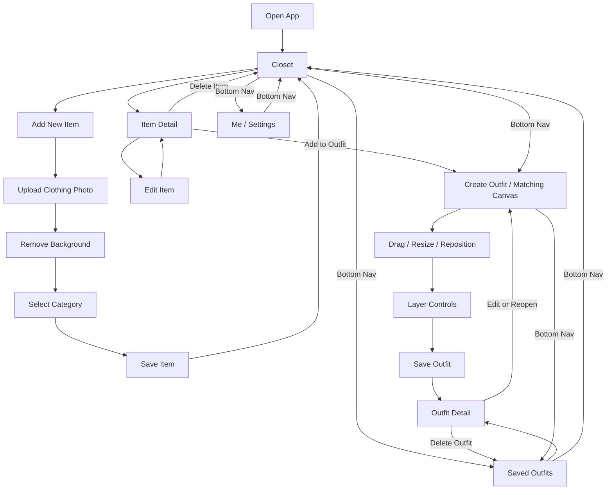

# E-Wardrobe Mobile UX Design

update time：2026-09-15

## 1. Product Summary

E-Wardrobe is a small mobile-first web app that lets one user upload a set of clothes and accessories as sticker-like cutouts, mix and match them on a canvas, save a satisfying outfit, and get help choosing an outfit for today.

**Primary Users:** Me, or anyone who cares about outfits and wants to choose faster before going out.

**Purpose:** Help users manage their wardrobe and arrange their outfits quickly without needing to try on repeatedly.

**Meaningful Interactions:** Upload, categorize, drag, layer, filter, remove, and save locally.

## 2. MVP Workflow

```text
Upload clothing photos
        ↓
Remove background and create sticker-like cutouts
        ↓
Select a category and save the item
        ↓
Filter items by Tops / Bottoms / Shoes / Accessories / Outerwear / Others
        ↓
Drag items onto the Matching Canvas
        ↓
Resize / reposition / change layer / remove
        ↓
Save the outfit locally
        ↓
View, edit, delete, or reopen the saved outfit
```

All MVP data is stored in local state and IndexedDB instead of a cloud database.

## 3. Information Architecture

The MVP contains **7 core pages**:

1. Closet
2. Add New Item
3. Item Detail
4. Create Outfit / Matching Canvas
5. Saved Outfits
6. Outfit Detail
7. Me / Settings

Upload progress, remove-background progress, filters, confirmations, and layer controls are page states, sheets, or dialogs—not separate pages.

### Primary Navigation

A persistent bottom navigation appears on the four main sections:

| Navigation item | Destination |
| --- | --- |
| Closet | Closet |
| Create | Create Outfit / Matching Canvas |
| Saved | Saved Outfits |
| Me | Me / Settings |

The default page when the app opens is **Closet**.

## 4. Page Specifications

### Page 1 — Closet

**Purpose:** Let the user view, search, filter, and manage all clothing items.

**Must include:**

- Page title: `Closet`
- Search field
- Category filters:
  - All Items
  - Tops
  - Bottoms
  - Shoes
  - Accessories
  - Outerwear
  - Others
- Clothing item grid
- Each item card contains:
  - Sticker-like clothing cutout
  - Item name or short label
  - Category
- Primary action: `Add New Item`
- Bottom navigation

**Main interactions:**

- Tap a category to filter the item grid
- Search for an item
- Tap an item to open `Item Detail`
- Tap `Add New Item` to open the upload flow

**Required states:**

- Empty closet: explain that no clothing has been added and show `Add New Item`
- Empty search/filter result: show `No matching items`
- Normal item grid

**Navigation:**

```text
Closet → Add New Item
Closet → Item Detail
Closet → Create Outfit     via bottom navigation
Closet → Saved Outfits     via bottom navigation
Closet → Me / Settings     via bottom navigation
```

---

### Page 2 — Add New Item

**Purpose:** Upload a clothing photo, remove its background, choose a category, and save it to the Closet.

**Must include:**

- Page title: `Add New Item`
- Back button to Closet
- Upload area
- Actions:
  - Choose from Photos
  - Take Photo, when supported
- Original image preview
- Remove background action
- Background-removal result preview
- Item name field
- Category selection:
  - Tops
  - Bottoms
  - Shoes
  - Accessories
  - Outerwear
  - Others
- Primary action: `Save Item`
- Secondary action: `Cancel`

**Main interactions:**

1. User uploads a clothing photo
2. App sends it to remove.bg
3. App turns it into a sticker-like cutout
4. User reviews the result
5. User enters a name and selects a category
6. User saves the item locally

**Required states:**

- Before upload
- Image selected
- Removing background / loading
- Background removed successfully
- Remove-background failure with `Try Again`
- Invalid image type or file too large
- Save disabled until required information is complete

**Navigation:**

```text
Closet → Add New Item → Save Item → Closet
Closet → Add New Item → Cancel → Closet
```

After saving, the new item should appear in the Closet immediately.

---

### Page 3 — Item Detail

**Purpose:** View one item and choose what to do with it.

**Must include:**

- Back button to Closet
- Large sticker-like item preview
- Item name
- Category
- Date added, optional for MVP
- Primary action: `Add to Outfit`
- Actions:
  - Edit Item
  - Delete Item

**Edit Item must allow:**

- Change item name
- Change category
- Replace the image, optional for the first MVP version
- Save changes

**Delete Item behavior:**

- Show a confirmation dialog before deletion
- Explain that the item will be removed from the Closet
- After confirmation, return to Closet

**Navigation:**

```text
Closet → Item Detail → Back → Closet
Item Detail → Edit Item → Save → Item Detail
Item Detail → Delete Item → Confirm → Closet
Item Detail → Add to Outfit → Create Outfit
```

When entering Create Outfit through `Add to Outfit`, the selected item is already placed on the Matching Canvas.

---

### Page 4 — Create Outfit / Matching Canvas

**Purpose:** Let the user mix and match clothing items on an outfit board.

**Must include:**

- Page title: `Create Outfit`
- Matching Canvas / Outfit Board
- Category / Item Tray
- Category filters:
  - Tops
  - Bottoms
  - Shoes
  - Accessories
  - Outerwear
  - Others
- Sticker-like clothing thumbnails
- Selected-item controls:
  - Bring Forward
  - Send Backward
  - Remove
- Primary action: `Save Outfit`
- Clear or reset action
- Bottom navigation, hidden or minimized while editing if more canvas space is needed

**Canvas interactions:**

- Tap or drag an item from the Item Tray onto the Matching Canvas
- Drag to reposition an item
- Resize an item
- Rotate an item, optional for the first MVP version
- Bring Forward
- Send Backward
- Remove from canvas

**Optional MVP extension:**

- Upload a personal photo
- Place digital clothing on the personal photo

This optional feature should not block completion of the standard outfit-board workflow.

**Required states:**

- Empty canvas with short guidance
- Canvas with one or more items
- Item selected with layer controls visible
- Unsaved changes warning when leaving
- Saving state
- Save success confirmation

**Save Outfit behavior:**

- Ask for an outfit name
- Generate a preview image
- Save the canvas item positions, sizes, rotations, and layers locally
- After saving, allow the user to remain on the canvas or open the saved outfit

**Navigation:**

```text
Closet → Create Outfit                 via bottom navigation
Item Detail → Add to Outfit → Create Outfit
Create Outfit → Save Outfit → Outfit Detail
Create Outfit → Saved Outfits          via bottom navigation
```

If the user tries to leave with unsaved changes:

```text
Keep Editing / Discard Changes / Save Outfit
```

---

### Page 5 — Saved Outfits

**Purpose:** Show all locally saved outfits in a gallery.

**Must include:**

- Page title: `Saved Outfits`
- Outfit gallery
- Each outfit card contains:
  - Preview image
  - Outfit name
  - Last edited date, optional for MVP
- Primary action: `Create Outfit`
- Bottom navigation

**Main interactions:**

- Tap an outfit to open `Outfit Detail`
- Tap `Create Outfit` to open a new empty Matching Canvas

**Required states:**

- Empty gallery with `Create Outfit`
- Saved outfit gallery

**Navigation:**

```text
Saved Outfits → Outfit Detail
Saved Outfits → Create Outfit
Saved Outfits → Closet / Me            via bottom navigation
```

---

### Page 6 — Outfit Detail

**Purpose:** View, edit, delete, or reopen a saved outfit.

**Must include:**

- Back button to Saved Outfits
- Large outfit preview
- Outfit name
- Primary action: `Edit Outfit`
- Actions:
  - Reopen in Matching Canvas
  - Delete Outfit

`Edit Outfit` and `Reopen in Matching Canvas` can use the same behavior in the MVP.

**Delete Outfit behavior:**

- Show a confirmation dialog
- Delete the locally saved outfit only after confirmation
- Return to Saved Outfits

**Navigation:**

```text
Saved Outfits → Outfit Detail → Back → Saved Outfits
Outfit Detail → Edit Outfit → Create Outfit with saved canvas data
Outfit Detail → Delete Outfit → Confirm → Saved Outfits
```

When an existing outfit is saved again, update the same outfit instead of creating a duplicate unless the user chooses `Save as New` in a future version.

---

### Page 7 — Me / Settings

**Purpose:** Provide basic app preferences and local-data controls.

**Must include:**

- Page title: `Me` or `Settings`
- Basic app preferences
- Local storage information
- About this app
- Bottom navigation

**Recommended MVP settings:**

- Light / dark / system theme
- Confirm before deleting items and outfits
- Storage usage summary
- Export local data, optional
- Import local data, optional
- Clear all local data

**Clear all local data behavior:**

- Clearly explain that clothes and saved outfits will be removed from this device
- Require confirmation
- Return to an empty Closet after completion

**Navigation:**

```text
Me / Settings → Closet / Create / Saved via bottom navigation
```

## 5. Complete Navigation Flow



## 6. Core User Flows

### Flow A — Add the first clothing item

```text
Empty Closet
→ Add New Item
→ Upload clothing photo
→ Remove background
→ Review sticker-like cutout
→ Select category
→ Save Item
→ Closet
```

### Flow B — Create and save an outfit

```text
Closet
→ Create
→ Filter by category
→ Add clothing items to Matching Canvas
→ Drag / resize / reposition
→ Bring Forward / Send Backward / Remove
→ Save Outfit
→ Outfit Detail
```

### Flow C — Start an outfit from one item

```text
Closet
→ Item Detail
→ Add to Outfit
→ Matching Canvas with selected item already added
→ Add more items
→ Save Outfit
```

### Flow D — Edit a saved outfit

```text
Saved Outfits
→ Outfit Detail
→ Edit Outfit / Reopen in Matching Canvas
→ Change position, size, layer, or items
→ Save changes
→ Outfit Detail
```

## 7. Global UX Requirements

- Design mobile-first and support one-handed use where possible
- Use the same category names throughout the app
- Always show progress while removing a background or saving an outfit
- Never lose unsaved canvas changes without warning
- Ask for confirmation before deleting an item, outfit, or all local data
- Use clear empty states that include the next action
- Keep the main actions visually consistent:
  - `Add New Item`
  - `Add to Outfit`
  - `Save Item`
  - `Save Outfit`
  - `Edit Outfit`
- Keep all data local for the MVP
- The visual direction is a **Digital fashion scrapbook / personal wardrobe journal**

## 8. MVP Priority

### Must Have

- Closet and categories
- Add New Item
- Upload clothing photo
- Remove background
- Save item locally
- Item Detail
- Matching Canvas
- Drag, resize, reposition, layer, and remove
- Save Outfit
- Saved Outfits gallery
- Outfit Detail
- Edit and delete saved outfits

### Nice to Have

- Personal photo on the Matching Canvas
- Rotation gesture
- Export and import local data
- Storage usage summary
- Dark mode

### Future Version

- User accounts
- Cloud synchronization
- Outfit suggestions for today
- Weather-based recommendations
- Automatic clothing recognition and categorization

